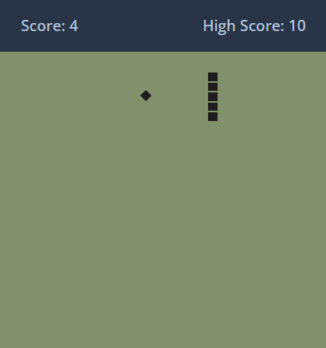
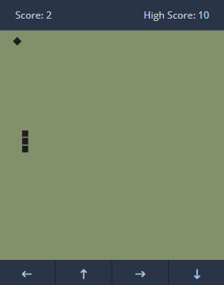

# 🐍 Snake Game

Um jogo clássico da cobrinha recriado com **HTML**, **CSS** e **JavaScript puro**, totalmente responsivo e jogável em dispositivos **desktop** e **mobile**.

🔗 **Acesse o projeto aqui**: [snake-game-omega-nine.vercel.app](https://snake-game-omega-nine.vercel.app)

---

## 🖼️ Capturas de Tela

| 💻 Desktop | 📱 Mobile |
|-----------|-----------|
|  |  |

---

## 🚀 Funcionalidades

✅ Movimento responsivo da cobra com teclado e toques  
✅ Pontuação e recorde salvos com `localStorage`  
✅ Comida aleatória no grid  
✅ Fim de jogo com recarregamento automático  
✅ Compatível com dispositivos móveis  

---

## 🛠️ Tecnologias Utilizadas

- HTML5  
- CSS3  
- JavaScript (ES6)  
- Font Awesome (ícones)

---

## 📱 Controles

- **Desktop**: Setas do teclado (↑, ↓, ←, →)  
- **Mobile**: Botões visuais com setas direcionais

---

## ⚙️ Como Rodar Localmente

Clone o repositório:

```bash
git clone https://github.com/guibarrosdevv/snake_game.git
Abra o arquivo index.html no navegador.
